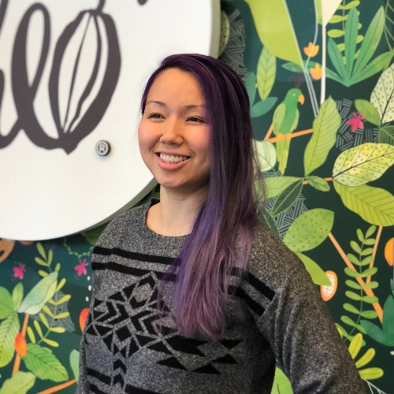

## About Nina Tran

She uses she/her/they pronouns. She is Deaf. She was born to her first-generation immigrant parents who could not afford education. They tried their hardest to help her and her sister succeed by any means, even if they lacked access to resources. When she moved to the United States of America, she never knew that she could go to a public school and learn sign language. That's when her world expanded. 

Fast forward to the present, she has a bachelor's degree in Disability Studies and Informatics from the University of Washington. She recently received her master's degree in Accessible Human-centered Computing from Gallaudet University.Her younger self would not believe that all of this could have happened. 

She has always been enquiring and enjoyed learning about the world. She is passionate about accessibility. With that in mind, she brings over 4 years of hands-on experience in research, encompassing qualitative and quantitative methodologies, statistical analysis, accessibility testing, and expertise in UX/UI. 

## Research Interest

Accessibility, Human-Computer Interaction, Smart Home Technology & Automation, Gaming, Assistive Technology, Product Development, AI Ethics, and how APIs can be applied to sign language technology. 

---
                                      opta ardua pennis astra sequi 

---

## Publications

1. **Assessment of Sign Language-Based versus Touch-Based Input for Deaf Users Interacting with Intelligent Personal Assistants**
   [[Publication]](https://doi.org/10.1145/3613904.3642094) 
3. **Sign Language-Based versus Touch-Based Input for Deaf Users with Interactive Personal Assistants in Simulated Kitchen Environments**
   [[Publication]](https://doi.org/10.1145/3613905.3651075)
4. **U.S. Deaf Community Perspectives on Automatic Sign Language Translation**
   [[Publication]](https://doi.org/10.1145/3597638.3614507)
   
## Awards

Year | Award | Category
-----|-------|--------
2023 | Bison Tank Business Award  | Won **third place** for designing a deaf-friendly dating app 
2023 | CRA-WP Grad Cohort for Women | Granted a travel Scholarship
2023 | CRA-WP Grad Cohort for IDEALS | Granted a travel scholarship
2022 | Tapia Conference Scholarship | Sponsored by AccessComputing
2021 | Dennis Leng Award | Nominated for the Best Outstandarding Student
2021 | Dean's List Scholarship | Awarded for achieving a GPA of 3.50 
2020 | Dean's List Scholarship | Awarded for achieving a GPA of 3.50 

