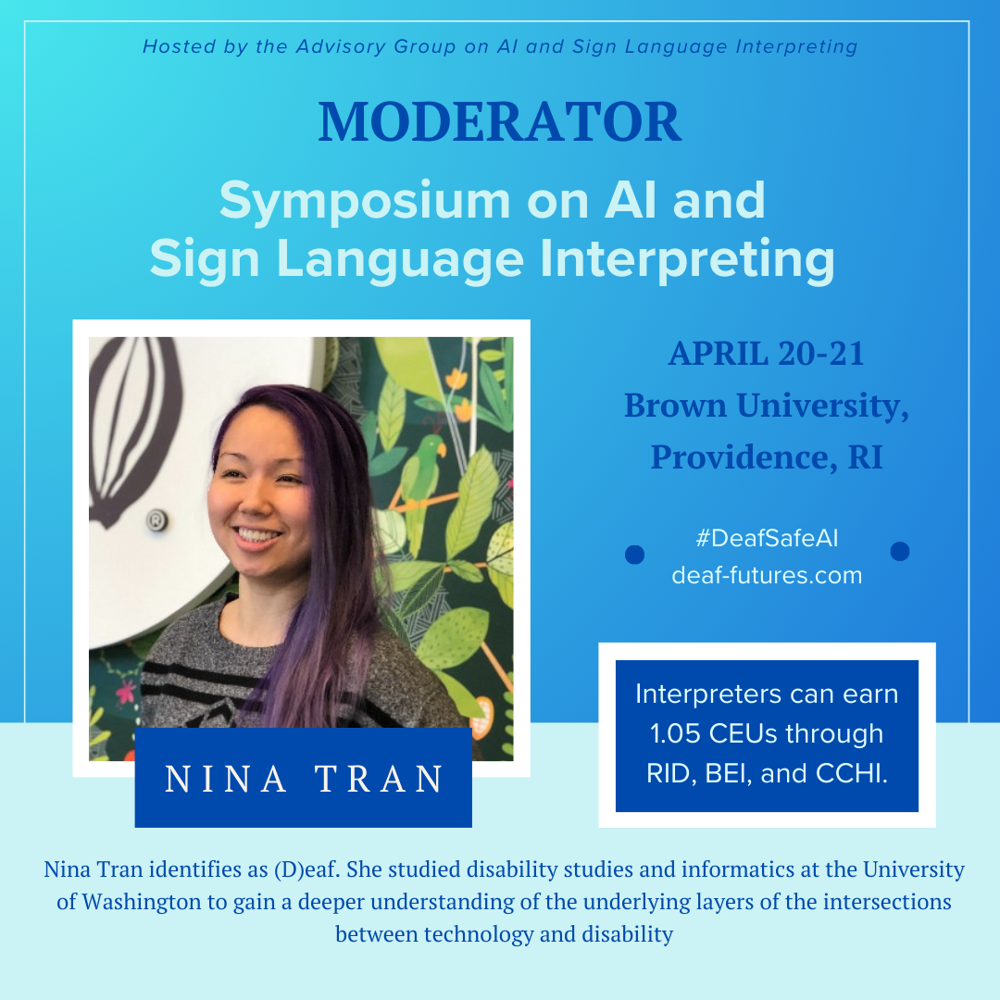
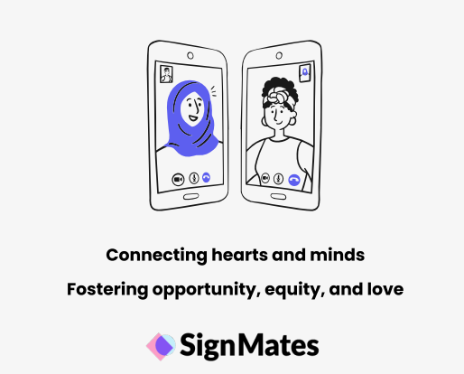

## 2024 

**Advisory Group on AI and Sign Language Interpreting**

#DeafSafeAI has two important social impact areas for automatic interpreting by artifical intelligence (AIxAI). This qualitative method centers on employing Deaf expertise to integrate safety and quity into AIxAI design, rather than concentrating on the prepardeness of general hearing culture. The participants perceive intermediate goals, including sign language and cultural preservation, being attained by short-term actions. Enforceable federal regulations must include precise definitions of short-term quality criteria. Sociotechnical design and accountability in AIxAI policies are guided by a well-defined vision of intended results. 

Our first #DeafSafeAI symposium took place in Providence, Rhode Island. I served as the moderator for the roundtable discussion featuring Dr. Eileen Forestal, Carola E. Morton, Silvia Muturi, Ryan Shephard, and Paul Tracy.  

Please visit the [#DeafSafeAI](https://deaf-futures.com/) website for more details. 

## 2023 

**Deaf Users Interacting with Intelligent Personal Assistants**

Image description: A participant signs to the Echo Show device with the iPad nearby and the webcam on top feeding video to the ASL interpreter behind the scene (the "Wizard"). 

We designed a Wizard-of-Oz experimental setup, which involves a complex process. Due to the limitations of IPA technology, it cannot recognize sign language. There is currently no sign language recognition technology available that facililates two-way communication. For a year and a half, we conducted two separate study phases involving deaf users interacting with IPAs within a home setting. One phase focused on the living environment, while the other focused on the kitchen environment. The aim of the project is to investigate how deaf users prefer to interact with IPAs. 
  
If you are curious to learn more about this project, please refer to my [paper](https://dl.acm.org/doi/10.1145/3613904.3642094) for more details.

**SignMates Matchmaking App**

  
Many matchmaking apps prioritize serving their mainstream users, often overlooking marginalized communities in the process. They often lack disability or accessibility features, and there is a severe scarcity of user research aimed at designing for the needs of marginalized users. Many marginalized users hesitate to disclose their identity due to societal norms that predominately favor those who are hearing and able-bodied.  

Our project specifically targeted two groups: deaf users who have previously used a matchmaking app and hearing users who have met or would like to meet a deaf person through a matchmaking app. We designed a deaf friendly matchmaking app tailored to the needs of the deaf community aiming to challenge societal norms and help deaf users feel more confident when connecting with others through such platforms.  

If you are interested in exploring our high-fidelity prototype of the SignMates matchmaking app, please feel free to interact with our [app](https://www.figma.com/proto/kIgdi7XGHz2nyywXoYaZl4/Milestone-6?kind=proto&node-id=47-1378&page-id=0%3A1&scaling=scale-down&starting-point-node-id=106%3A1062&viewport=606%2C132%2C0.06) and refer to our [project](https://signmates.myportfolio.com/milestones) for more details.

## 2022 

Deaf Community's Perspectives & Sign Language Recognition

## 2021 

