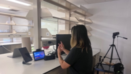
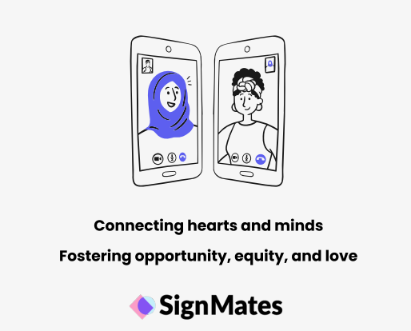
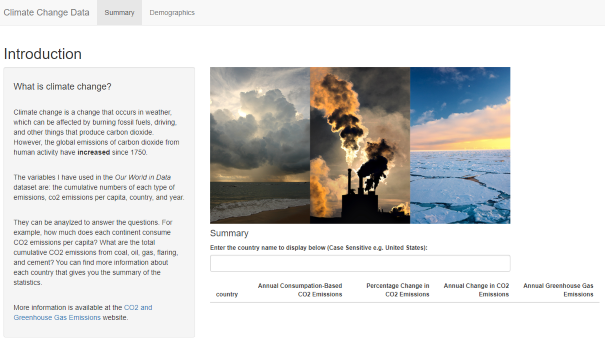
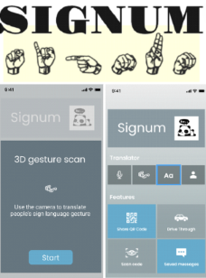

## 2024 

**Advisory Group on AI and Sign Language Interpreting**

#DeafSafeAI has two important social impact areas for automatic interpreting by artifical intelligence (AIxAI). This qualitative method centers on employing Deaf expertise to integrate safety and quity into AIxAI design, rather than concentrating on the prepardeness of general hearing culture. The participants perceive intermediate goals, including sign language and cultural preservation, being attained by short-term actions. Enforceable federal regulations must include precise definitions of short-term quality criteria. Sociotechnical design and accountability in AIxAI policies are guided by a well-defined vision of intended results. 

Our first #DeafSafeAI symposium took place in Providence, Rhode Island. I served as the moderator for the roundtable discussion featuring Dr. Eileen Forestal, Carola E. Morton, Silvia Muturi, Ryan Shephard, and Paul Tracy.  

Please visit the [#DeafSafeAI](https://deaf-futures.com/) website for more details. 

## 2023 

**Deaf Users Interacting with Intelligent Personal Assistants**

We designed a Wizard-of-Oz experimental setup, which involves a complex process. Due to the limitations of IPA technology, it cannot recognize sign language. There is currently no sign language recognition technology available that facililates two-way communication. For a year and a half, we conducted two separate study phases involving Deaf and hard-of-hearing (DHH) users interacting with IPAs within a home setting. One phase focused on the living environment, while the other focused on the kitchen environment. The aim of the project is to investigate how DHH users prefer to interact with IPAs. 
  
If you are curious to learn more about this project, please refer to my [paper](https://dl.acm.org/doi/10.1145/3613904.3642094) for more details.

**SignMates Matchmaking App**

  
Many matchmaking apps prioritize serving their mainstream users, often overlooking marginalized communities in the process. They often lack disability or accessibility features, and there is a severe scarcity of user research aimed at designing for the needs of marginalized users. Many marginalized users hesitate to disclose their identity due to societal norms that predominately favor those who are hearing and able-bodied.  

Our project specifically targeted two groups: Deaf and hard-of-hearing (DHH) users who have previously used a matchmaking app and hearing users who have met or would like to meet a DHH person through a matchmaking app. We designed a deaf friendly matchmaking app tailored to the needs of the deaf community aiming to challenge societal norms and help deaf users feel more confident when connecting with others through such platforms.  

If you are interested in exploring our high-fidelity prototype of the SignMates matchmaking app, please feel free to interact with our [app](https://www.figma.com/proto/kIgdi7XGHz2nyywXoYaZl4/Milestone-6?kind=proto&node-id=47-1378&page-id=0%3A1&scaling=scale-down&starting-point-node-id=106%3A1062&viewport=606%2C132%2C0.06). 

For more details, please visit our [project](https://signmates.myportfolio.com/milestones) website. 

## 2022 

**Deaf Community's Perspectives & Sign Language Recognition**

Million of Deaf and hard-of-hearing (DHH) individuals primarily rely on sign language for communication, yet face a shortage of interpreters. The emergence of automatic sign language translation (ASLT) systems could help bridge the gap between sign and spoken languages in situations where human interpreters are unavailable. Recent advancements in large multilinigual language models suggest that ASLT could become a reality. Despite its potential, the Deaf community's perspectives on these sign language technolognies are poorly understood. To address this gap, we conducted a survey within the Deaf community in the U.S. to gather insights on ASLT, aiming to develop user-centered systems. Our findings provide valuable insights into when DHH users in the U.S. might prefer to use ASLT, their expectations, design preferences, and perceived benefits and concerns. This research seeks to inform the development of ASLT, ensuring it meets user needs while minimizing drawbacks. 

Please refer to my [paper](https://dl.acm.org/doi/10.1145/3597638.3614507) for more details. 

## 2021 

**Climate Change Data Dashboard** 

Climate change remains a significant global concern, with varying impacts on individuals depending on their geographical location and economic status. For my INFO 201 course at the University of Washington, I was tasked with utilizing my data analysis and visualization skills to investitgate trends in CO2 emissions using data complied by [Our World in Data](https://ourworldindata.org/co2-and-greenhouse-gas-emissions). Then I built an interactive Shiny application enabling users to explore various countries and observe their corresponding CO2 emissions trends over time. 

Please visit my [data dashboard](https://ninatkt.shinyapps.io/a4-ninatkt/) and feel free to interact with it.  

**Signum Communication App** 

Due to limited sign language interpretation services and communication barriers, many DHH individuals face challenges including social isolation, which can result in emotional discomfort from low self-esteem and confidence. This project report included a stakeholder analysis, a value scenario evaluation, and an exploration of popular sign language technologies, an interview with a DHH individual, and the development of a solution to facililate interpersonal communication and meal ordering. Our findings reveal the need for more research and technological advancements in this area because the existing alternatives need to be improved in terms of accuracy, effectiveness, and accessibility. 

Solution: We designed Signum, a commuication app, aimed at facilitating social interaction between DHH and hearing users.  

If you are interested in exploring our high-fidelity prototype of the Signum app, please feel free to interact with our [app](https://www.figma.com/proto/xiq294h09pmLGyuLhUpiVE/Signum?node-id=25-0&scaling=scale-down&page-id=0%3A1). 

Please refer to our [project report](assets/signum-report.pdf) for more details. 

