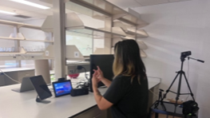

## 2024 

## 2023 
### Deaf Users Interacting with Intelligent Personal Assistants (IPAs) 
We designed a Wizard-of-Oz experimental setup, which involves a complex process. Due to the limitations of IPA technology, it cannot recognize sign language. There is currently no sign language recognition technology available that facililates two-way communication. For a year and a half, we conducted two separate study phases involving deaf users interacting with IPAs within a home setting. One phase focused on the living environment, while the other focused on the kitchen environment. The aim of the project is to investigate how deaf users prefer to interact with IPAs, addressing the following research questions: 

Phase 1 - Living Room: 
- RQ1: What are the perceptions and preferences of deaf users regarding sign language-based versus touchscreen-based input methods while interacting with IPAs?
- RQ2: What is the nature of the interaction between deaf users and IPAs within the confines of a limited-domain application?
- RQ3: What is the range of expression and vocabulary seen among deaf users interacting with IPAs within the confines of a limited-domain application?

Phase 2 - Kitchen: 
- RQ1: What are deaf and hard of hearing users’ preferences for interacting with IPAs in settings that require them to get their hands dirty?
- RQ2: In what ways do dirty hands affect sign language production when interacting with IPAs? 

If you are curious about the answers to our research questions, please refer to my [paper](https://dl.acm.org/doi/10.1145/3613904.3642094) for more details. 

What was the process behind designing our Wizard-of-Oz experimental setup? This setup requires the use of multiple devices, such as the Amazon Echo Show, iPad tablet, Phillips Hue for multicolor lighting, digital cameras, and laptops. To stimulate natural interactions between deaf users and IPAs in their home environment, we made adjustments to have our IPA, Alexa, respond to their signed commands. 

Figure 1: A participant signs to the Echo Show device with the iPad nearby and the webcam on top feeding video to the ASL interpreter behind the scene (the "Wizard"). 

### SignMates Dating App 

## 2022 

## Deaf Community's Perspectives & Sign Language Recognition 

## 2021 

